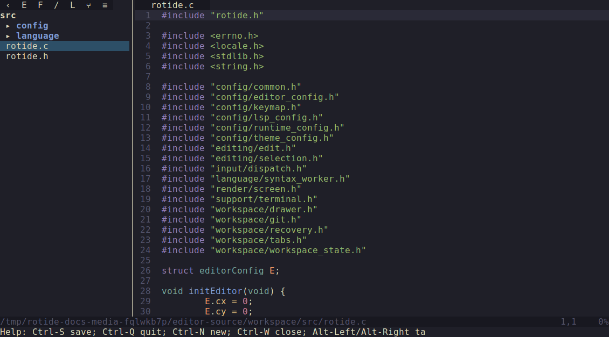

# RotIDE

RotIDE is a terminal text editor inspired by
[kilo](https://github.com/antirez/kilo), focused on predictable behavior,
explicit data flow, and strong regression coverage.

## Status

RotIDE is under active development. Core editing, tabs, drawer navigation,
search, undo/redo, Tree-sitter highlighting, crash recovery, LSP-backed
definition lookup, an LSP Problems drawer, and incremental ESLint integration
are implemented and tested.



## Screenshots

See [docs/media/screenshots/](docs/media/screenshots/README.md) for the feature
and theme showcase. Regenerate screenshots with:

```bash
make docs-media
```

Use `make docs-media DOCS_MEDIA_FLAGS=--skip-lsp` to skip language-server
scenes.

## Quick Start

Requirements:

- POSIX-like environment
- C compiler with C2x support

Build and run:

```bash
make
./rotide README.md
```

Run tests:

```bash
make test
make test-sanitize
```

If LeakSanitizer is flaky locally:

```bash
ASAN_OPTIONS=detect_leaks=0 make test-sanitize
```

Build a size-oriented release binary:

```bash
make release
```

Use `make V=1` to print full compiler and linker commands.

## Features

- UTF-8/grapheme-safe editing and cursor movement.
- Multi-tab workflow with preview tabs from drawer clicks.
- Project drawer with expand/collapse, mouse resize, file search, project text
  search, Git changes, and LSP Problems/Symbols views.
- Search, go to line, matching bracket jump, selection/copy/cut/paste.
- Undo/redo with edit grouping.
- Configurable keymap and editor settings.
- Atomic save flow and crash recovery snapshots.
- Optional OSC52 clipboard sync.
- Built-in themes plus custom TOML themes.
- Tree-sitter syntax highlighting for C/C++, Go, Shell, HTML, JavaScript,
  TypeScript, TSX, CSS/SCSS, JSON/JSONC, Python, PHP, Rust, Java, C#,
  Haskell, Ruby, OCaml, Julia, Scala, EJS, ERB, Markdown, TOML, YAML, XML,
  Make, Diff, and Regex.
- LSP definition lookup for Go, C/C++, HTML, CSS/SCSS, JSON, and JavaScript.
- LSP-backed document symbols, problems drawer, and autocomplete where enabled.
- ESLint diagnostics and manual `eslint_fix` action for JavaScript buffers.
- Missing-language-server install/help prompts with read-only task-log output.

Syntax fixture samples are stored in [`tests/syntax/`](tests/syntax/README.md).

## Default Keybindings

- `Ctrl-S`: save
- `Ctrl-Q`: quit, confirming when dirty or a task is running
- `Ctrl-N`: new tab
- `Ctrl-W`: close tab
- `Alt-Right` / `Alt-Left`: next/previous tab
- `Ctrl-Shift-Alt-Left` / `-Right` / `-Up` / `-Down`: move the active tab to the neighbouring pane
- `Ctrl-E`: toggle focus between editor and drawer
- `Ctrl-\`: collapse/expand drawer
- `Alt-M`: open the main menu in the drawer
- `Alt-Shift-Left` / `Alt-Shift-Right`: resize drawer
- `Ctrl-P`: search files in the drawer
- `Ctrl-Alt-F`: search text across the project
- `Ctrl-Alt-L`: show LSP Problems/Symbols drawer
- `Ctrl-F`: search
- `Ctrl-G`: go to line
- `Ctrl-]`: jump to matching bracket
- `Ctrl-O` / `Ctrl + left click`: go to definition for supported source buffers
- `Alt-Z`: toggle soft line wrapping
- `Alt-N`: toggle absolute line numbers
- `Alt-H`: toggle current-line highlight
- `Ctrl-B`: toggle selection
- `Ctrl-C` / `Ctrl-X` / `Ctrl-D` / `Ctrl-V`: copy/cut/delete/paste selection
- `Ctrl-Z` / `Ctrl-Y`: undo/redo
- `Ctrl-Left` / `Ctrl-Right`: move by word
- arrows, home/end, page up/page down: movement and viewport navigation

`eslint_fix`, `scroll_left`, and `scroll_right` are configurable actions without
default bindings in the built-in keymap.

## Configuration

RotIDE reads TOML config from `~/.rotide/config.toml` only. On first launch it
auto-creates that file, and `~/.rotide`, with the documented defaults.

Project-local `.rotide.toml` files are not loaded for general editor/LSP
settings. Opening an untrusted repo should not let it override LSP server
commands, keybindings, or other settings.

See [`config.toml.example`](config.toml.example) for the complete option list.
Common sections:

- `[editor]`: cursor style/blink, line wrap, line numbers, current-line
  highlight, indentation, column selection drag modifier.
- `[theme]`: built-in or custom theme selection.
- `[lsp]`: language-server enable flags, commands, install commands, and
  autocomplete settings.
- `[keymap]`: action bindings.

Built-in themes include `terminal`, `a11y-dark`, `a11y-light`, `acme`,
`silentium`, `256noir`, `github-light`, `github-dark`, `modus-operandi`,
`modus-operandi-tinted`, `modus-vivendi`, `modus-vivendi-tinted`, `molokai`,
`kanagawa-wave`, `kanagawa-dragon`, and `kanagawa-lotus`.

## Developer Documentation

Architecture and maintenance docs live under
[`docs/developer/`](docs/developer/README.md):

- [Architecture](docs/developer/architecture.md)
- [Workflows](docs/developer/workflows.md)
- [Build and tests](docs/developer/build-and-tests.md)

PlantUML diagram sources live under [`docs/diagrams/src/`](docs/diagrams/src/)
and committed SVGs live under [`docs/diagrams/svg/`](docs/diagrams/svg/).
Regenerate them with:

```bash
make docs-diagrams
```

## CI

GitHub Actions runs:

- `make`
- `make test`
- `make test-sanitize`

Workflow file: [`.github/workflows/ci.yml`](.github/workflows/ci.yml)

## License

See [`LICENSE`](LICENSE).
