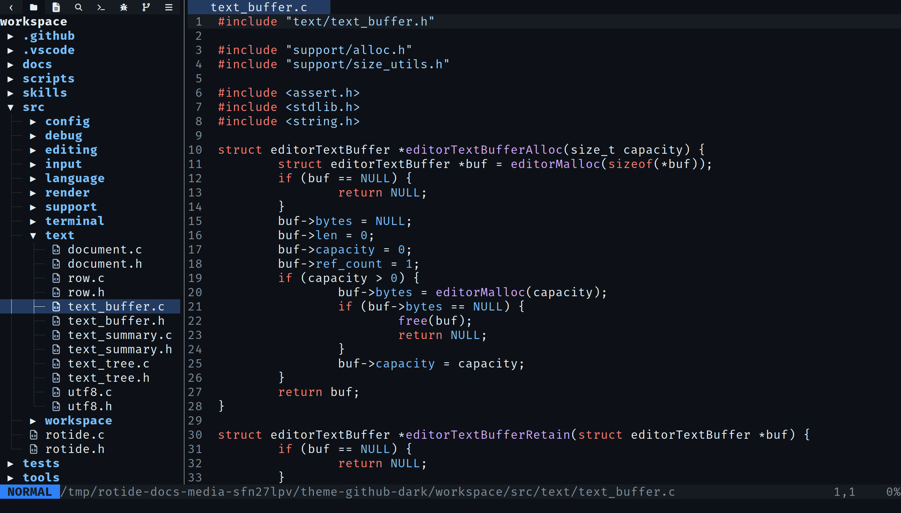

# RotIDE

RotIDE is a terminal text editor focuses on predictable behavior, explicit data flow, and strong regression coverage. Its earliest shape was inspired by antirez's
[kilo](https://github.com/antirez/kilo).

RotIDE is under active development. Core editing, multi-tab workflow, a project
drawer with file/text search and Git changes, undo/redo, Tree-sitter syntax
highlighting, crash recovery, and LSP-backed definitions/problems/symbols are
implemented and tested.



[➡️ More screenshots here](docs/media/screenshots/README.md)

## Highlights

- UTF-8/grapheme-safe editing with multi-tab and split-pane workflow.
- Project drawer: file search, project-wide text search, Git changes, and LSP
  Problems/Symbols.
- Modal **Vim** input system (the default) or **CUA**, both configurable.
- Tree-sitter highlighting for 30+ languages; LSP definitions, symbols,
  problems, and autocomplete where enabled.
- Atomic saves with crash-recovery snapshots; built-in and custom TOML themes.

See the [user guide](docs/user/README.md) for the full feature list,
keybindings, and configuration.

## Quick start

Requirements:

- POSIX-like environment
- C compiler with C2x support

Build and run:

```bash
make
./build/rotide README.md
```

Run tests:

```bash
make test
make test-sanitize
```

If LeakSanitizer is flaky locally, prefix with `ASAN_OPTIONS=detect_leaks=0`.
Build a size-oriented release binary with `make release`. Use `make V=1` to
print full compiler and linker commands.

## Documentation

- [User guide](docs/user/README.md) — features, keybindings, configuration,
  screenshots.
- [Developer docs](docs/developer/README.md) — architecture, workflows, build
  and tests.
- [Metrics dashboard](docs/developer/metrics-dashboard.md) — CI trend charts
  for tests, benchmarks, fuzzing, and lines of code.

## License

See [`LICENSE`](LICENSE).
