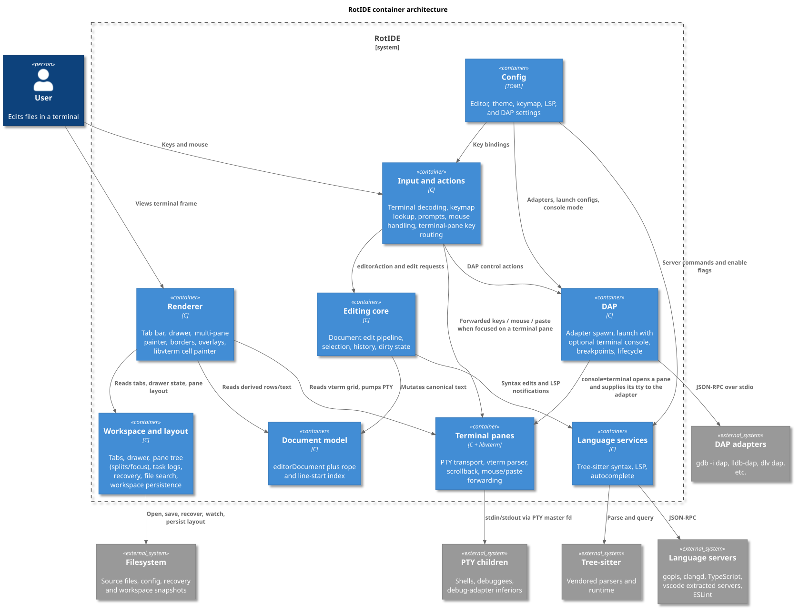
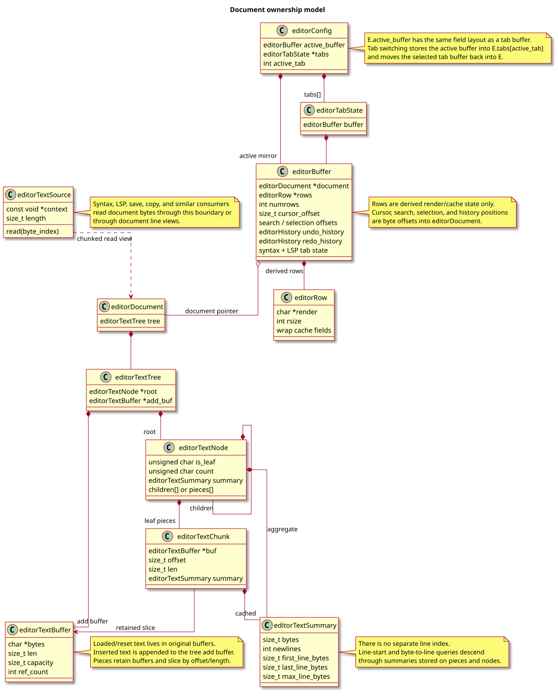
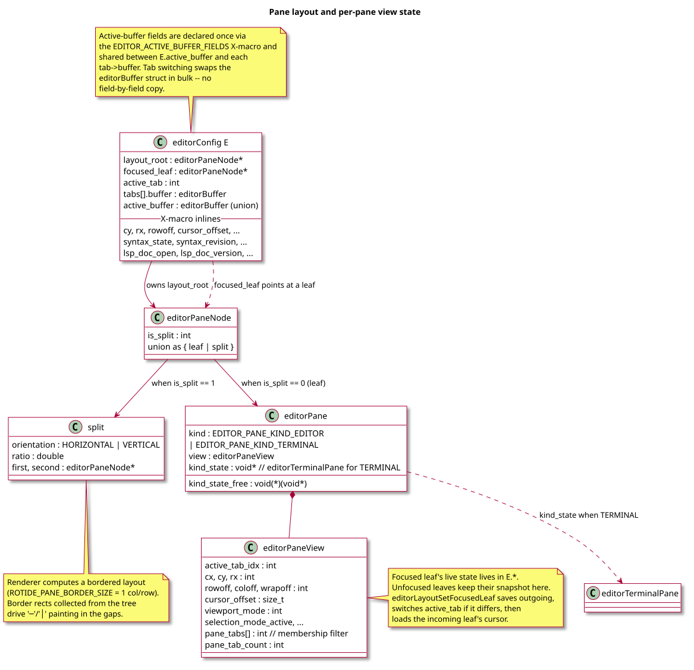
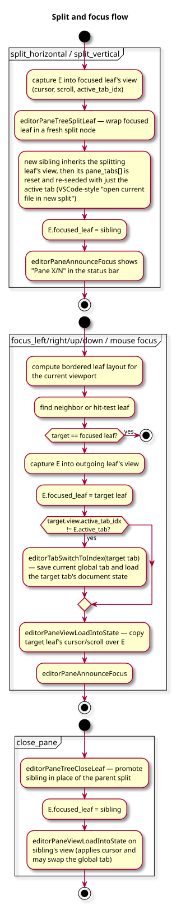
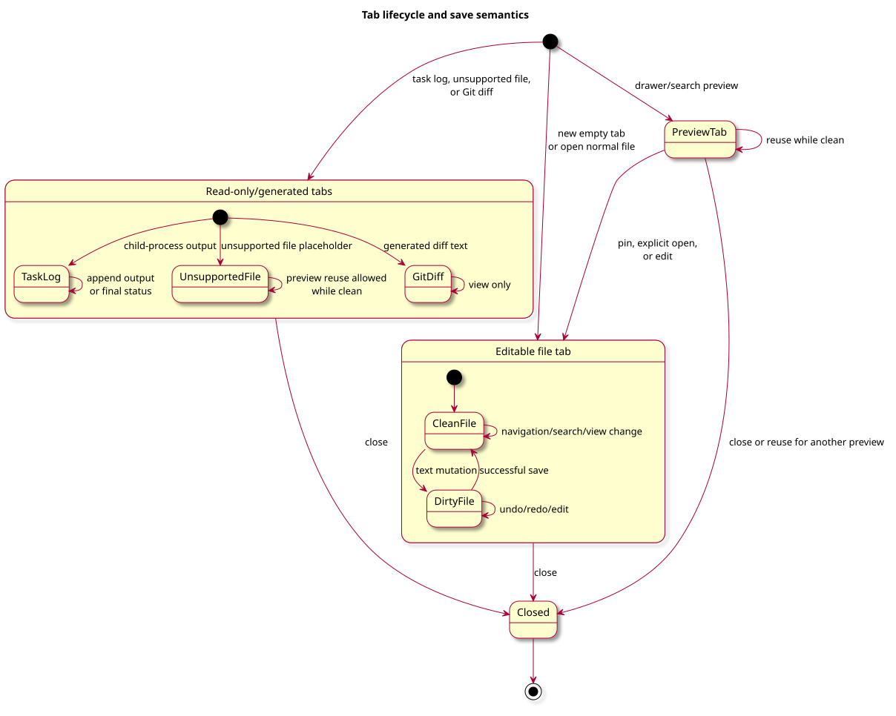
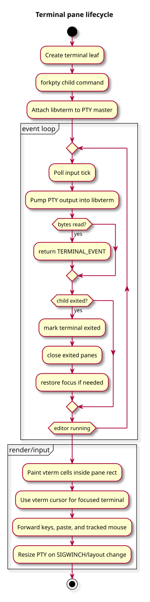
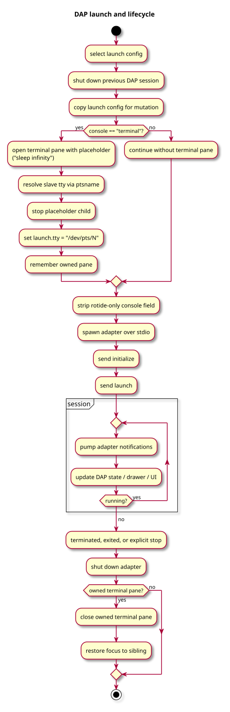
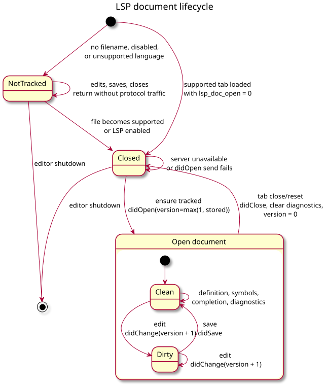

# Architecture

RotIDE keeps one main editor process and state model, with helper threads for
Tree-sitter background parsing and child processes for LSP servers, task logs,
project search, terminal panes (PTY + libvterm), and DAP adapters. The main
design rule is that text has one writable owner: `editorDocument`. Rows,
syntax captures, rendered columns, diagnostics, search matches, and viewports
are derived from that document or from tab-local state.



## State Model

The global editor state lives in `struct editorConfig E` (`src/rotide.h`). It
groups its fields into containers — environment, the active buffer, workspace
state (tabs, drawer, recovery), Git state, DAP session, editor preferences,
viewport + layout, and the keymap/popup/termios state — annotated by comment
in the struct definition so new fields land in the right cluster.

The "active buffer" cluster is the canonical view onto the focused tab. It is
defined once via the `EDITOR_ACTIVE_BUFFER_FIELDS` X-macro and reused in two
places:

```c
struct editorBuffer {
    EDITOR_ACTIVE_BUFFER_FIELDS(EDITOR_DECLARE_FIELD)
};

struct editorConfig {
    /* ... */
    union {
        struct editorBuffer active_buffer;
        struct { EDITOR_ACTIVE_BUFFER_FIELDS(EDITOR_DECLARE_FIELD) };
    };
    /* ... */
};
```

Each tab in `E.tabs[]` carries its own `struct editorBuffer`. Tab switching
no longer copies fields one by one: it swaps the X-macro members in bulk
between `E.active_buffer` and the selected tab's `buffer`. The same X-macro
declares the field names directly inside `editorConfig` so existing
`E.cursor_offset`, `E.cy`, `E.rowoff`, ... call sites keep working.

`enum editorPrimaryFocus` (`EDITOR_PRIMARY_FOCUS_TEXT`/`_DRAWER`) records
whether the keymap routes input at the text body or the drawer. This is
distinct from pane focus, which is owned by the layout tree — the
"primary focus" vocabulary keeps the drawer-vs-text concept from being
overloaded with the actual pane-tree concept.

The important ownership split is:

- `editorDocument`: canonical bytes for a tab.
- `editorRope`: chunked byte storage used by the document.
- `line_starts`: document-owned line index for byte/line mapping.
- `struct erow`: derived row text and render cache.
- `cursor_offset`, search offsets, and selection anchors: canonical positions.
- `cy`, `cx`, `rx`, `rowoff`, `coloff`, `wrapoff`: derived or view state. The
  focused pane's copy lives directly in `E`; unfocused panes keep their
  snapshot in `editorPaneView` and swap into `E` on focus change.



`src/text/document.c` owns document reset, copy, replace, and byte/line
mapping. `src/text/rope.c` owns chunked storage. `src/text/row.c` owns UTF-8
and grapheme-aware row helpers. `src/editing/buffer_core.c` bridges the
document model to active editor state.

## Text and Dirty State

Text mutations are represented as `struct editorDocumentEdit` and applied
through `editorApplyDocumentEdit()`. That descriptor is the contract for byte
range, inserted text, cursor movement, and dirty-state transitions; the
step-by-step mutation order is covered in [Workflows](workflows.md).

Navigation, search, viewport changes, drawer changes, pane focus moves, and
LSP requests do not mark a tab dirty. Undo and redo restore both text and
dirty metadata from operation history, not from full-buffer snapshots.

## Input and Actions

Key behavior routes through `enum editorAction`. Defaults are built in
`src/config/keymap.c`, optional user bindings are loaded from
`~/.rotide/config.toml`, and `src/input/dispatch.c` maps decoded terminal
input to actions. `dispatch.c` stays as the orchestrator; larger gate and
action-family code is split into `src/input/prompt.c`, `mouse.c`,
`text_pairs.c`, and `actions_*.c`.

Several gates run before the keymap lookup:

- **Synthetic events** (`RESIZE_EVENT`, `TASK_EVENT`, `SYNTAX_EVENT`,
  `WATCH_EVENT`, `TERMINAL_EVENT`, `BRACKETED_PASTE_START/END_EVENT`,
  `INPUT_EOF_EVENT`) short-circuit before the editor sees them as regular
  keys.
- **Prompt mode** forwards the byte to the active prompt callback.
- **Mouse events** are hit-tested against the layout: clicks/wheel/drag that
  land in a terminal pane with mouse tracking on are forwarded to libvterm
  (and a click also refocuses that pane); otherwise they go to the
  drawer/tab/text handler.
- **Terminal-pane key gate**: when the focused leaf is a terminal pane and
  the user is not in the drawer, keystrokes are routed straight to the PTY
  via `editorTerminalPaneSendKey` unless the next chord is the configured
  `terminal_prefix`. Pressing the prefix arms a one-shot escape that makes
  the *next* keypress dispatch through the normal keymap.

Keeping commands action-based makes key behavior testable and keeps prompt,
mouse, drawer, editor, terminal, pane, and DAP commands on the same dispatch
path.

## Panes and Layout

`src/workspace/layout.{c,h}` owns a binary tree of `editorPaneNode`s rooted
at `E.layout_root`. Each leaf carries an `editorPane` with a kind tag, a
per-pane `editorPaneView` (cursor, scroll, viewport mode, selection state,
the active tab index, and a per-pane tab membership list), and an optional
`kind_state` payload released by a `kind_state_free` callback when the leaf
is closed. Internal nodes describe a vertical or horizontal split with a
clamped ratio.



The renderer computes a bordered layout (`ROTIDE_PANE_BORDER_SIZE = 1`) that
reserves a single column/row between siblings; `editorLayoutCollectBorders`
walks the tree to produce border rects, and `editorBorderCellAt` classifies
each cell during paint so `─`, `│`, and gap cells render correctly even with
nested splits.

`editorLayoutSetFocusedLeaf` is the canonical focus operation: it captures
`E.*` into the outgoing leaf's view, optionally calls
`editorTabSwitchToIndex` if the incoming leaf records a different active
tab, then loads the incoming leaf's cursor on top. The dispatch handlers for
`split_horizontal`/`split_vertical`/`close_pane`,
`focus_left/right/up/down`, mouse focus, and `pane_grow`/`pane_shrink` all
route through layout-module APIs so the invariants stay in one place. Each
pane keeps its own membership list of which global tab indices live in it;
the tab strip filters by that list and `editorTabSwitchByDelta` cycles
within it.

The layout shape (splits + ratios + orientations) is persisted in the
workspace state file via `editorLayoutSerialize`'s compact s-expression so
the user's split layout survives across sessions. Pane kind-state (terminal
panes in particular) is session-bound and not persisted.



## Tabs, Drawer, and Read-only Views

File tabs are editable and savable. Preview tabs come from drawer/file-search
navigation and can be pinned when edited or explicitly opened. Task-log tabs
are generated documents used for child-process output; they are read-only and
not savable. Unsupported-file and Git-diff tabs also avoid normal save
semantics.



Tabs themselves live in the shared `E.tabs[]` array, but each pane stores
which tab indices it shows in `editorPaneView.pane_tabs[]`. Splitting a
pane re-seeds the new sibling's membership with only the splitting pane's
active tab — VSCode-style "open current file in new split." Closing a tab
removes it from the focused pane's list; the global entry survives if any
other pane still holds it.

The drawer is a view over project tree entries, search results, Git state,
and LSP problem/symbol entries. It does not own file text.

## Rendering

`src/render/screen.c` builds the terminal frame from active state and delegates
surface work to focused modules: tab bar, drawer view, pane view, status bar,
terminal cells, wrapping, viewport, popups, and low-level output helpers. The
top of `editorDrawRows` chooses between a fast single-pane path and a
multi-pane path; the multi-pane path is taken whenever there is more than one
leaf or any leaf is a terminal pane. Multi-pane rendering iterates rows, paints
the drawer + separator, then uses `src/render/pane_view.c` to walk the editor
body with the collected border list and leaf layout. Pane slices are dispatched
to focused editor rows, unfocused same-tab editor rows, terminal cells via
`src/render/terminal_view.c`, blank space, or split borders.

Cursor positioning is pane-aware: when the focused leaf is a terminal
pane, cursor row/col come from `vterm_state_get_cursorpos` translated into
the pane's screen rect; otherwise they come from the editor's
`cursor_offset`/`rx`/`coloff` math anchored to the focused leaf's rect.

Soft wrapping and rendered columns depend on row caches. The canonical
cursor position remains `cursor_offset`; row/column fields are synchronized
through mapping helpers when text or cursor state changes.

## Terminal Panes

`src/terminal/pty.{c,h}` provides the PTY transport: `editorPtySpawn` runs
the command via `/bin/sh -c` inside a `forkpty(3)` child, sets the master
fd non-blocking + close-on-exec, seeds the initial winsize, and exposes
non-blocking reap and `TIOCSWINSZ` resize.

`src/terminal/terminal_pane.{c,h}` couples a PTY child with a libvterm
parser. `editorTerminalPaneCreate` builds a `VTerm` with the
`settermprop` callback wired so DECSET 1000/1002/1003 updates
`mouse_tracking` and the `vterm_output_set_callback` writes encoded
keyboard/mouse/paste output back to the master fd. The struct is heap
owned, registered on the pane leaf via `kind_state` and `kind_state_free`
so closing the pane releases everything.

The main-loop input poll (`editorReadKey`) calls
`editorTerminalPanePumpAll` on each VTIME tick (~100 ms). It drains every
master fd into vterm via `vterm_input_write`, marks `exited` when the
child has been reaped, and returns `TERMINAL_EVENT` if any bytes were
consumed so the next refresh repaints. Exited terminal panes are closed
from the event/draw path, with focus restored to the surviving sibling when
needed. SIGWINCH propagates through `editorTerminalPaneResizeAllToLayout`
which mirrors the renderer's split math and `TIOCSWINSZ`-resizes each pane.



libvterm is vendored under `vendor/libvterm/` with relaxed warnings in
the Makefile (mirroring the tree-sitter carve-out).

## DAP

`src/debug/dap.{c,h}`, `src/debug/dap_client.{c,h}`,
`src/debug/dap_console.{c,h}`, and `src/config/dap_config.{c,h}` implement the
Debug Adapter Protocol client. Adapter commands live under
`[dap.adapters]` and launch templates under `[dap.defaults]`/`[dap.launch]`
in TOML; the parser exposes generic launch fields plus a name/adapter/
request triple.

When a launch is started, `editorDapPrepareTerminalConsole` inspects the
rotide-specific `console` field on a local copy of the launch config. If
the value is `"terminal"`, it opens a terminal pane via
`editorTerminalPaneOpenSplit("sleep infinity", ...)`, resolves the slave
tty with `ptsname(master_fd)`, and writes it into the launch JSON's `tty`
field (which gdb-dap and lldb-dap honor for the inferior's I/O). The
placeholder child is stopped after the tty is resolved; the pane keeps the
PTY host for the inferior. The leaf is tracked in `E.dap_terminal_leaf`; on
session teardown
(`editorDapShutdown` or a `terminated`/`exited` event) the owned pane is
closed automatically. `console` is always stripped from the outgoing JSON
because it is a rotide layout hint, not a DAP standard field.



The built-in `c_app`/`cpp_app` defaults ship with `console = "terminal"`,
so debugging C/C++ targets gives the inferior a clean rotide-hosted
terminal pane out of the box.

## Syntax

Syntax state is tab-local (`editorSyntaxState`). The Tree-sitter integration
is split into focused modules under `src/language/`:

- `syntax.c` — public API, tab-local state, the main parse driver.
- `syntax_detect.c` — language detection from filename and shebang.
- `syntax_predicates.c` — query-predicate evaluation
  (`#match?`, `#eq?`, etc.).
- `syntax_locals.c` — locals analysis and the locals-aware capture
  cache.
- `syntax_budget.c` — query/parse time budgets, limit events, and the
  performance-mode degradation ladder.
- `syntax_indent.c` — bracket-scope-based indent anchors used by
  newline insertion.
- `syntax_captures.c` — capture collection for a byte range.
- `syntax_injections.c` — injected-language tree management.
- `languages.c` — table-driven parser metadata.
- `queries.c` — query compilation and the embedded query table.
- `syntax_worker.c` — background parse worker thread.

Query text is embedded at build time from
`scripts/queries_manifest.txt` into `src/language/syntax_query_data.h`.
Tree-sitter parsing uses `editorTextSource`, so syntax can read document
bytes without requiring a permanent flattened buffer. Query budgets and
injection limits degrade behavior before hard-disabling highlighting for
large or expensive inputs.

The background syntax worker is documented in
[concurrency.md](concurrency.md) — it receives snapshots tagged with
`(revision, generation)` and commits only results that still match the
tab's current values.

## LSP

LSP is split across a family of focused modules:

- `src/language/lsp.c` — the per-`(server_kind, workspace_root)` client
  type, top-level lifecycle calls, and the public request surface used
  by editor actions.
- `src/language/lsp_registry.c` — keyed table of live clients. Tabs do
  not own clients; they look the right one up by
  `(server_kind, workspace_root)` whenever they need to issue a request.
  Switching between two Go tabs from the same workspace reuses the
  client; switching between two clangd workspaces transparently spawns
  the second.
- `src/language/lsp_documents.c` — the per-tab `didOpen` / `didChange` /
  `didSave` / `didClose` flow, version counters, and full-document vs.
  range-change selection.
- `src/language/lsp_features.c` — definition, implementation,
  completion, document symbols, code actions.
- `src/language/lsp_responses.c` — JSON-RPC response parsing for
  request types.
- `src/language/lsp_protocol.c` — request/response builders.
- `src/language/lsp_transport.c` — child-process spawn, framed
  JSON-RPC over pipes.
- `src/language/lsp_json.c` — JSON encoding/decoding helpers.
- `src/language/lsp_mock.c` — in-process mock used by tests.

There is no implicit "active LSP" singleton: every call site captures
the client it needs by name, e.g.
`struct editorLspClient *client = editorLspEnsureClientForFile(filename, ...);`
and then issues requests against `client`. This is what makes a single
rotide session safely talk to several language servers across several
workspaces at once.



LSP diagnostics are stored on the owning tab and rendered through the LSP
drawer and text overlays. ESLint is a separate JavaScript diagnostics/fix
provider that runs alongside the JavaScript/TypeScript server through the
same registry slot.

## Save and Recovery

Saves use `src/support/file_io.c` for the atomic temp-file/fsync/rename
flow. Save syscall wrappers in `src/support/save_syscalls.c` make failure
paths testable.

Recovery snapshots are document-first.  `src/workspace/recovery.c`
persists tab state and text, restores tabs on startup when requested, and
normalizes older row-oriented data into the current document model.

`src/workspace/workspace_state.c` is the adjacent persistence path for
non-document state — drawer width and mode, recent files, the open-tab
list, and the serialized pane layout tree
(`editorLayoutSerialize` writes a `layout=<expr>` line; the loader
deserializes and replaces `E.layout_root`).

`src/workspace/watch.c` is poll-based: every `EDITOR_WATCH_FILE_POLL_MS`
(250 ms) it `stat(2)`s each tab's file to detect external changes, and every
`EDITOR_WATCH_GIT_POLL_MS` (1000 ms) it refreshes Git state. There is no
inotify/kqueue dependency.

## Module Map

- `src/rotide.c`, `src/rotide.h`: process lifecycle, global state, main
  loop (incl. per-tick syntax poll + LSP/DAP pump + viewport update,
  then refresh + keypress dispatch).
- `src/support/`: terminal raw mode and signal handlers (which also
  drive LSP/DAP/syntax shutdown), allocation, file IO, testable save
  syscalls.
- `src/text/`: document, rope, UTF-8, grapheme, row/render helpers.
- `src/editing/`: document edit application (`edit.c`,
  `edit_pipeline.c`), edit-vs-document bridge (`document_bridge.c`,
  `document_position.c`, `text_source.c`), post-edit notification fanout
  to syntax/LSP/diagnostics (`post_edit_notify.c`), row cache
  (`row_cache.c`), history, selection, search range helpers
  (`buffer_search.c`), active-buffer ownership (`buffer_core.c`).
- `src/input/`: action dispatch (`dispatch.c`), prompts (`prompt.c`),
  mouse handling, terminal-pane key gate, bracketed paste, text-pair
  handling, per-family action helpers (`actions_edit`,
  `actions_workspace`, `actions_file_tab`, `actions_language`,
  `actions_terminal_debug`).
- `src/render/`: frame orchestration (`screen.c`), single- and multi-
  pane painter (`pane_view.c`), tab bar (`tab_bar.c`), drawer view
  (`drawer_view.c`), status/message bars (`status_bar.c`), libvterm
  cell painter (`terminal_view.c`), wrap/viewport helpers
  (`wrap.c`, `viewport.c`), overlays/popups (`popup.c`), ANSI/theme
  and write-buffer primitives (`ansi_style.c`, `display_text.c`,
  `write_buf.c`).
- `src/workspace/`: tabs, drawer (`drawer.c` + per-mode
  `drawer_mode_{menu,git,lsp,dap}.c` + `drawer_tree.c`,
  `drawer_file_ops.c`, `drawer_layout.c`, `drawer_modes.c`), project
  search, Git, recovery, task logs, file watcher (poll-based),
  pane layout (`layout.c`), workspace state.
- `src/config/`: TOML loading for editor, theme, keymap, LSP, DAP, and
  runtime config; the theme module is split into builtin tables
  (`theme_builtin.c`), TOML parser (`theme_parse.c`), and shared
  internals (`theme_internal.h`).
- `src/language/`: Tree-sitter (split into the `syntax_*` family above),
  LSP (split into the `lsp_*` family above), autocomplete, language
  metadata.
- `src/terminal/`: PTY transport and terminal pane (libvterm bridge).
- `src/debug/`: DAP orchestration, adapter transport helpers, and terminal
  console integration.
- `vendor/libvterm/`: vendored libvterm 0.3.x — built with the same
  warnings-relaxed carve-out as Tree-sitter.
- `tests/`: behavior tests split by subsystem along the production
  boundaries — e.g. `test_syntax_{activation,parse,captures,
  background,state}.c`, `test_render_{frame,chrome,panes,terminal}.c`,
  `test_workspace_{persistence,theme_config,keymap_view,io}.c`,
  `test_input_{actions,selection,mouse,search,undo}.c`,
  `test_lsp_{protocol,lifecycle,completion,diagnostics,navigation}.c`,
  plus `test_dap.c` and `test_terminal_pane.c`.

Cross-cutting concerns get their own pages:

- [concurrency.md](concurrency.md) — the syntax background worker's
  snapshot/revision protocol.
- [error_handling.md](error_handling.md) — the OOM/return-`0`/status-bar
  contract and where validation belongs (boundaries only).
- [workflows.md](workflows.md) — sequenced flows through the
  containers above.

Keep future architecture docs at this level: explain ownership,
contracts, and flows before listing functions.
