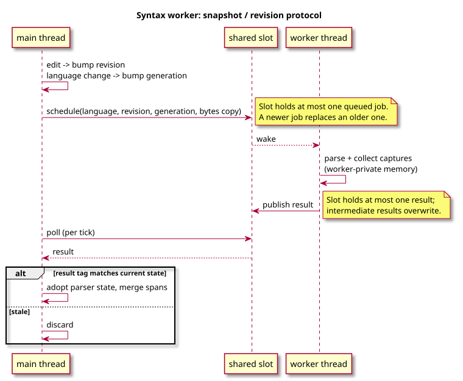

# Concurrency

RotIDE is single-threaded except for one worker: Tree-sitter parsing for the
focused tab. Everything else (LSP, DAP, terminal panes, project search) is
*separate processes* over pipes/PTYs, drained from the main thread.

## Syntax worker protocol

Each tab carries two counters in its `editorBuffer` (see [architecture.md](architecture.md)):

- `syntax_revision` — bumped on any edit / undo / redo / external reload.
- `syntax_generation` — bumped when the *language* changes (save-as).

The worker owns nothing in `E`: it parses a `malloc`-owned byte copy into a
fresh `editorSyntaxState` and publishes a result tagged with the snapshot's
`(language, revision, generation)`. `editorSyntaxBackgroundPoll` drops the
result unless those three still match — that is the entire safety story.

The slot holds at most one queued job and one pending result; staleness is
absorbed by overwrite, not by queueing.

## Shutdown

`editorSyntaxBackgroundStop` sets the stop flag, broadcasts the condvar, and
`pthread_join`s the worker. It is called from both clean quit
(`actions_file_tab.c`) and the termination signal handler in
`src/support/terminal.c`, alongside `editorLspShutdown` / `editorDapShutdown`.

The signal path is not strictly async-signal-safe (malloc, mutex). The
trade-off is intentional: when SIGINT/SIGTERM arrives the editor is blocked
on `read()`, and reaping adapter children beats leaking them.

## Not parallel

- Incremental Tree-sitter edits and small-document parses still run on the
  main thread; the worker is an optimization, not the primary parser.
- LSP/DAP/terminal-pane/project-search I/O is poll-driven on the main
  thread. No I/O threads.

If you ever need another worker, follow the same shape: snapshot, tag,
parse on worker-owned memory, validate on publish.
