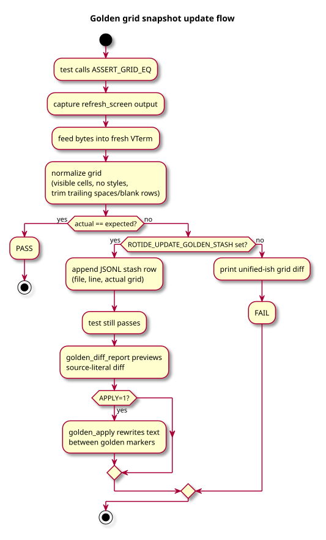
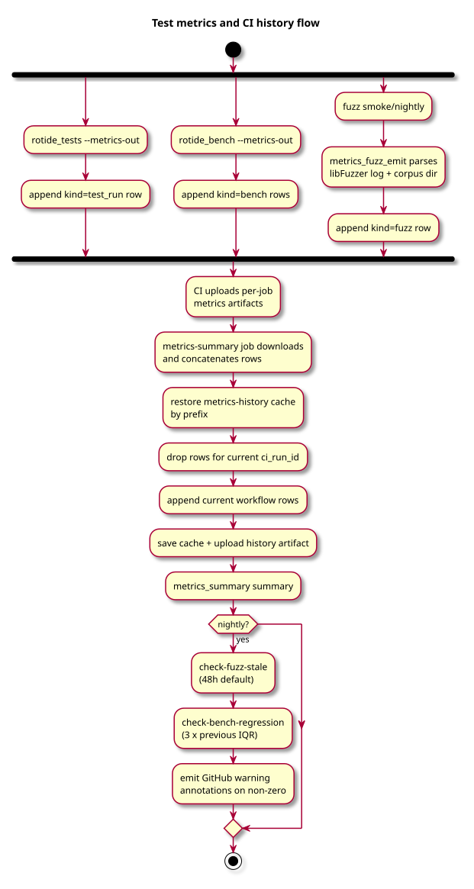

# Testing

RotIDE uses one C test binary, `build/tests/rotide_tests`. Tests link the editor
sources directly (minus `rotide.c`'s `main`) and drive real editor APIs. The
suite covers unit-like helpers, full editor workflows, property tests,
subprocess/PTY paths, fuzz harnesses, golden render snapshots, long-session
memory checks, and performance signals.

For the command reference, see [build-and-tests.md](build-and-tests.md). This
page explains the model and where to add coverage.

## Model


All normal tests share the same runner. The differences are what they exercise
and which validation layer wraps the run:

| Category | Examples | Purpose |
|---|---|---|
| Isolated helpers | UTF-8, text tree, runner internals, metrics parsers | Leaf behavior without editor state |
| Pipeline tests | edit/input/render/workspace/LSP/DAP/layout suites | Real `editorConfig E` and production code paths |
| Property / differential | `text_invariants`, `syntax_incremental_equiv` | Seeded random ops against invariants or a reference |
| Subprocess / PTY | `pty`, `terminal_pane`, crash-handler smoke | Fork, signal, PTY, and libvterm behavior |
| Long session | `test_long_session.c` | Warmup + measured loops with RSS/live-allocation bounds |
| Fuzz | `tests/fuzz/{vterm,lsp,dap,toml}` | Untrusted byte boundaries under libFuzzer |
| Bench / metrics | `rotide_bench`, `metrics_summary` | Performance trend and CI history signals |

`editorDocument` is the canonical writable text state. Tests should read line
bytes through document APIs or the read-only test API; do not assert raw text
through `struct editorRow`.

## Runner Pipeline


The runner filters suites/tests, applies quarantine, optionally shuffles with a
printed seed, and runs suites sequentially or in forked workers (`--jobs N`).
Each test starts from `reset_editor_state`. With `--validate-reset` enabled
(the default in `make test`), the runner snapshots the clean `editorConfig E`
state and verifies every reset returns to that byte-identical baseline.

Parallel mode isolates failures at suite granularity. Child output is captured
under `tests/artifacts/logs/<suite>.log`; the parent replays logs in suite
index order so deterministic-output checks still work. Crashes write
`tests/artifacts/crashes/<suite>/<test>.crash` with the signal, seed, test name,
and backtrace.

## Validation Layers

| Layer | Trigger | Catches |
|---|---|---|
| `-Wall -Wextra -Werror` | every build | warnings and compile-time regressions |
| Reset validator | `--validate-reset` | leaked state in `editorConfig E` |
| Suite forks | `--jobs N` | crash isolation, parallel-only ordering bugs |
| Quarantine age | `make test-quarantine-age` | stale quarantined entries (>30 days by default) |
| Quarantine passing | `make test-quarantine-passing` | quarantined tests that now pass |
| Determinism | `make test-determinism` | nondeterministic PASS/FAIL/SKIP output |
| Crash smoke | `make test-crash-handler` | the crash reporting path itself |
| ASan + UBSan | `make test-sanitize` | memory errors and undefined behavior |
| TSan | `make test-tsan` | races in threaded/async paths |
| Fuzz smoke | `make fuzz-*-smoke` | parser crashes on committed seed + mutations |
| Nightly fuzz | `make fuzz-*-nightly` | longer corpus growth and stale-coverage signal |

## Golden Grid Snapshots



Render tests should prefer normalized grid snapshots over raw terminal-byte
assertions when the behavior is visible on screen. `ASSERT_GRID_EQ` captures a
full refresh, feeds it through libvterm, strips trailing spaces/blank rows, and
compares a deterministic multi-line grid. Keep raw byte checks only for escape
protocol details such as cursor shape or OSC sequences.

Use the golden update path when a deliberate layout change needs many literal
updates:

```bash
make update-goldens UPDATE_GOLDEN_FLAGS='--filter <name>'
make update-goldens APPLY=1 UPDATE_GOLDEN_FLAGS='--filter <name>'
```

The first command captures mismatches to `tests/artifacts/goldens.jsonl` and
prints a diff. `APPLY=1` rewrites the source between `/* golden-start */` and
`/* golden-end */` markers, preserving indentation. The machinery lives in
`tests/grid_snapshot_update.*`, `tests/grid_snapshot_format.*`,
`tests/golden_apply_lib.*`, `build/tests/golden_apply`, and
`build/tests/golden_diff_report`.

## Fuzzing

Fuzzing is limited to boundaries that consume hostile or externally controlled
bytes:

| Target | Parser | Harness | Per-PR smoke |
|---|---|---|---|
| `vterm` | vendored libvterm escape stream | `tests/fuzz/vterm/fuzz_vterm.c` | `make fuzz-vterm-smoke` |
| `lsp` | `Content-Length` LSP frames | `tests/fuzz/lsp/fuzz_lsp.c` | `make fuzz-lsp-smoke` |
| `dap` | `Content-Length` DAP frames | `tests/fuzz/dap/fuzz_dap.c` | `make fuzz-dap-smoke` |
| `toml-theme` | theme TOML stream | `tests/fuzz/toml/fuzz_toml_theme.c` | `make fuzz-toml-theme-smoke` |

Smoke targets copy the committed corpus into a temp directory so new libFuzzer
finds do not dirty the seed set. Nightly targets use `corpus_grown/` directories
restored and saved through CI cache. Add minimized crash inputs to the relevant
corpus and add a normal regression test when the behavior can be expressed
without libFuzzer.

## Metrics and Benchmarks



`tests/metrics.jsonl` is append-only JSON Lines. Producers opt in with
`METRICS_OUT=path` or `--metrics-out path`; rows include `kind`, `ts`, and
optional workflow metadata from `ROTIDE_METRICS_GIT_SHA`,
`ROTIDE_METRICS_GIT_REF`, and `ROTIDE_METRICS_CI_RUN_ID`.

| Row kind | Producer | Main fields |
|---|---|---|
| `test_run` | `rotide_tests --metrics-out` | wall time, run counts, failures, crashes, reset drift, quarantine skips, seed, jobs |
| `bench` | `rotide_bench --metrics-out` | name, samples, inner ops, min/p50/p95/IQR ns |
| `fuzz` | `metrics_fuzz_emit` after fuzz smoke/nightly | target, coverage/features, corpus sizes, exec count, RSS, final-stats flags |

`build/tests/metrics_summary` reads one file or CI's rolling history:

```bash
./build/tests/metrics_summary summary --in tests/metrics.jsonl
./build/tests/metrics_summary check-fuzz-stale --in tests/metrics-history.jsonl --window-hours 48
./build/tests/metrics_summary check-bench-regression --in tests/metrics-history.jsonl --factor 3
```

CI uploads per-job metrics artifacts, merges them in a `metrics-summary` job,
deduplicates the rolling history by `ci_run_id`, and saves it back through
`actions/cache`. Nightly currently emits warning annotations for stale fuzz
coverage and bench regressions; hard-fail only after the noise floor is known.

Microbenches live in `tests/bench_microbenches.c` and run with `make bench`.
Storage-specific throughput/RSS checks live in `tests/bench_text_storage.c`
and run with `make bench-buffer`. `make bench-render-once` uses `hyperfine` to
time a real `./build/rotide --render-once <large fixture>` cold-open/render path.

## Adding Coverage

1. Prefer an existing `tests/test_<area>.c`; otherwise add the source to
   `TEST_SRCS`, declare it in `rotide_tests_main.c`, and tag the suite.
2. Drive production paths. Test-only APIs may expose read-only state and
   counters, not mutators that production cannot call.
3. For text behavior, assert through `editorDocument` views or read-only row
   helpers, not `editorRow` raw storage.
4. For property tests, derive per-test randomness from `rotide_test_seed()` so
   one printed seed reproduces the whole run.
5. For visible render behavior, use `ASSERT_GRID_EQ`; keep raw byte assertions
   for terminal protocol bytes.
6. For a fuzz-found bug, keep the corpus seed and add the smallest normal unit
   test that proves the fix.
7. Run `make` and `make test`; add `ASAN_OPTIONS=detect_leaks=0 make
   test-sanitize` for storage, save/recovery, syntax, LSP/DAP, build, or fuzz
   work.

## Where Things Live

- Runner: [tests/rotide_tests_main.c](../../tests/rotide_tests_main.c),
  [tests/runner_support.c](../../tests/runner_support.c)
- Parallel/crash runner: [tests/parallel_runner.c](../../tests/parallel_runner.c)
- Reset validator: [tests/editor_state_snapshot.c](../../tests/editor_state_snapshot.c)
- Quarantine: [tests/QUARANTINE.md](../../tests/QUARANTINE.md),
  [scripts/check_quarantine_age.sh](../../scripts/check_quarantine_age.sh),
  [scripts/check_quarantine_passing.sh](../../scripts/check_quarantine_passing.sh)
- Grid snapshots/goldens: [tests/test_grid_snapshot.c](../../tests/test_grid_snapshot.c),
  [tests/grid_snapshot_update.c](../../tests/grid_snapshot_update.c),
  [tests/golden_apply_lib.c](../../tests/golden_apply_lib.c)
- Fuzz: [tests/fuzz/](../../tests/fuzz/)
- Metrics: [tests/metrics_jsonl.c](../../tests/metrics_jsonl.c),
  [tests/metrics_summary.c](../../tests/metrics_summary.c)
- Benches: [tests/bench_runner.c](../../tests/bench_runner.c),
  [tests/bench_microbenches.c](../../tests/bench_microbenches.c),
  [tests/bench_text_storage.c](../../tests/bench_text_storage.c)
