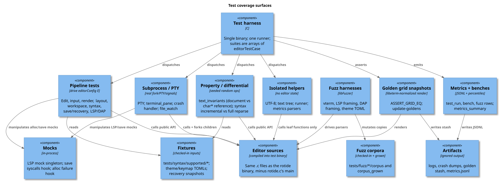
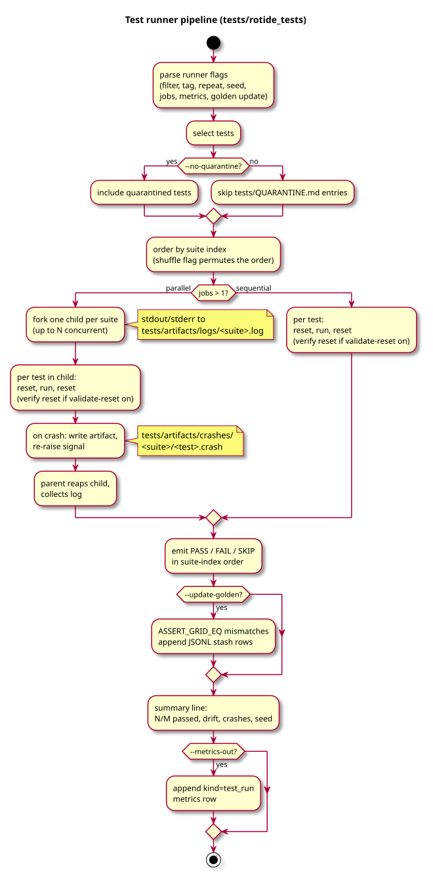

# Testing

All tests live in a single program, `tests/rotide_tests`. There is no
separate framework or folder for unit tests versus integration tests
versus memory tests; they all run side by side through the same runner.

What actually differs between tests is two things:

1. **What part of the editor each test exercises.** Some tests check a
   single helper function in isolation. Others drive the full edit
   pipeline through real user-style actions. Others spawn real
   subprocesses (PTYs, child shells). The [Categories](#categories)
   section sorts them.
2. **Which validation layer is wrapped around the run.** The same test
   can be run plain, under AddressSanitizer, under ThreadSanitizer, in
   parallel forked workers, or under the deterministic-output gate.
   Each layer catches a different class of bug. The
   [Validation layers](#validation-layers) section enumerates them.

For the command reference (which make target does what), see
[build-and-tests.md](build-and-tests.md). The rest of this page
explains the model.

## How the test binary is built

`tests/rotide_tests` links the editor's `.c` files directly: the same
sources the `rotide` binary uses, minus `rotide.c`'s `main`. Tests then
call the real editor APIs; nothing is stubbed.

Because the editor keeps its live state in one global struct
(`editorConfig E`), the runner resets that struct between every test so
each one starts from a clean slate. When `--validate-reset` is on (it is
by default in `make test`), the runner also verifies the reset is
complete: it snapshots the struct's bytes after the first reset and
compares every later reset against that snapshot, so any test that
leaves residual state behind fails loudly.

`--jobs N` runs up to N suites in parallel by `fork()`ing one child per
suite. Each child gets its own copy of the global state, which means a
crash in one suite no longer takes down the rest of the run, and
wall-clock time scales roughly linearly with available cores.

## Categories



Descriptive, not enforced. Suites tag by subject, not category:

- **Isolated helpers**: single function, no editor state (UTF-8, rope,
  runner internals).
- **Pipeline tests**: drive `editorConfig E` through real edit, syntax,
  LSP, render code.
- **Property / differential**: seeded random ops; invariant +
  byte-equality assertions (`text_invariants`,
  `syntax_incremental_equiv`).
- **Subprocess tests**: real PTYs (`pty`, `terminal_pane`), real forks.
  LSP/DAP use in-process mocks; not subprocess tests.

## Validation layers

| Layer | Trigger | Catches |
|---|---|---|
| `-Wall -Wextra -Werror` | always | compile-time UB-adjacent bugs |
| `--validate-reset` | default in `make test` | state leaks across tests in `editorConfig E` |
| `--jobs N` + crash handler | `TEST_FLAGS` | suite-level isolation, parallel speedup, crash artifacts under `tests/artifacts/` |
| ASan + UBSan | `make test-sanitize` | memory errors, out-of-bounds, UB |
| TSan | `make test-tsan` | data races (syntax worker, LSP/DAP transports, PTY) |
| Determinism gate | `make test-determinism` | nondeterministic outcomes |
| Crash-handler smoke | `make test-crash-handler` | the crash path itself, via `ROTIDE_TEST_CRASH` |

No dedicated memory-test suite: `make test-sanitize` covers
leak/UAF/overflow/UB across every test.

## Pipeline



Not on the diagram:

- Per-suite child output buffers to `tests/artifacts/logs/<suite>.log`
  and emits in suite-index order, so the determinism gate works in parallel too.
- Crash artifacts under `tests/artifacts/crashes/<suite>/<test>.crash`
  carry signal, seed, test name, and a backtrace.

## Tags

Tags live on the suite (not per-test). `--tag X` selects, `--filter S`
narrows by substring.

| Tag | Suites |
|---|---|
| `document` | `document_text_editing` |
| `syntax` | six `syntax_*` + `syntax_incremental_equiv` |
| `threads` | `syntax_background` |
| `lsp` | five `lsp_*` |
| `dap` | `dap` |
| `input` | five `input_*` |
| `render` | four `render_*` |
| `workspace` / `save` / `recovery` | workspace + save-recovery |
| `pty` / `terminal` | `pty`, `terminal_pane` |
| `slow` | `dap`, `file_watch`, `pty`, `terminal_pane` |
| `property` | `text_invariants`, `syntax_incremental_equiv` |
| `runner` | `runner_internals` |
| `layout` / `file_watch` | the like-named suites |

## Reproducing a failure

Every FAIL prints `seed=0x…`. Same seed plus same `--jobs` reproduces:

```bash
./tests/rotide_tests --filter editor_undo_inserts_block --seed 0xabc
```

Add `--shuffle` if the original had it. A repro that diverges from the
original is real nondeterminism. Fix it, don't paper over.

## Adding a test

1. Add a function to an existing `tests/test_<area>.c` (or create a new
   file, add a `SUITE_EXTERN` + row in `rotide_tests_main.c`, add to
   `TEST_SRCS` in the Makefile).
2. Register the function in the suite's `editorTestCase[]` array.
3. Property tests: salt `rotide_test_seed()` with a per-test constant
   so cases explore disjoint op spaces under a single CLI seed.
4. Run `ASAN_OPTIONS=detect_leaks=0 make test-sanitize` before landing.

## Where things live

- Runner: [tests/rotide_tests_main.c](../../tests/rotide_tests_main.c),
  [tests/runner_support.c](../../tests/runner_support.c)
- Parallel + crash handler: [tests/parallel_runner.c](../../tests/parallel_runner.c)
- Validator: [tests/editor_state_snapshot.c](../../tests/editor_state_snapshot.c)
- Per-test seed: [tests/seed.h](../../tests/seed.h)
- Test-only editor API: [tests/editor_test_api.h](../../tests/editor_test_api.h)
- Quarantine: [tests/QUARANTINE.md](../../tests/QUARANTINE.md)
- CI smokes: [scripts/check_test_determinism.sh](../../scripts/check_test_determinism.sh),
  [scripts/check_crash_handler.sh](../../scripts/check_crash_handler.sh)

