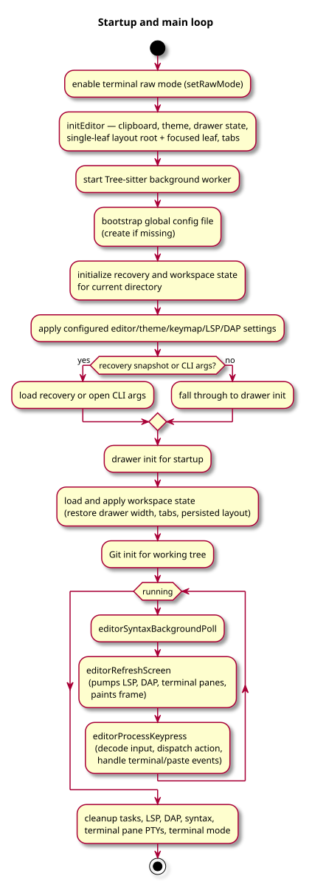
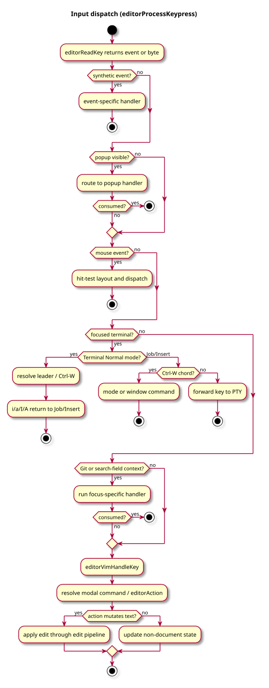
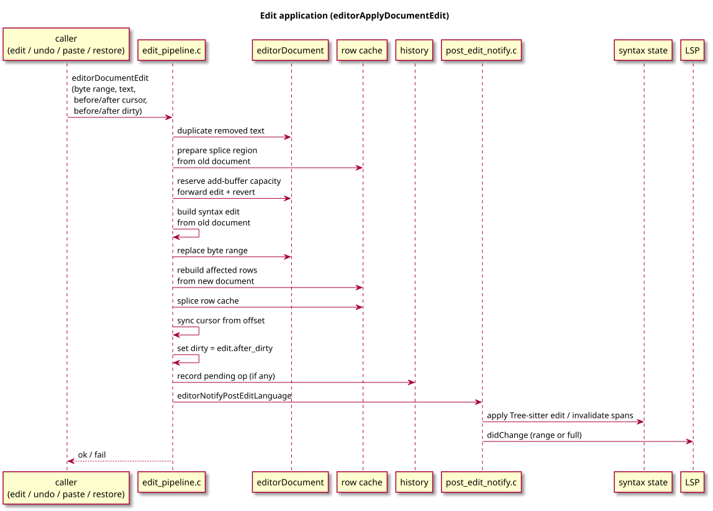
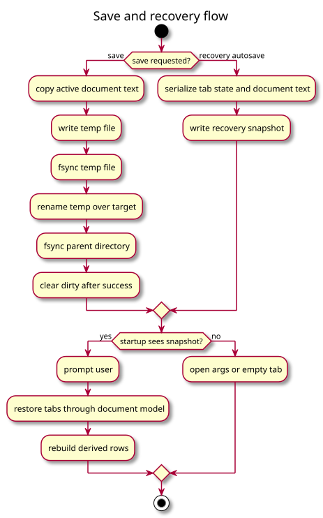
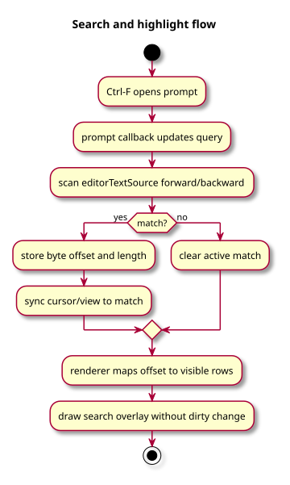
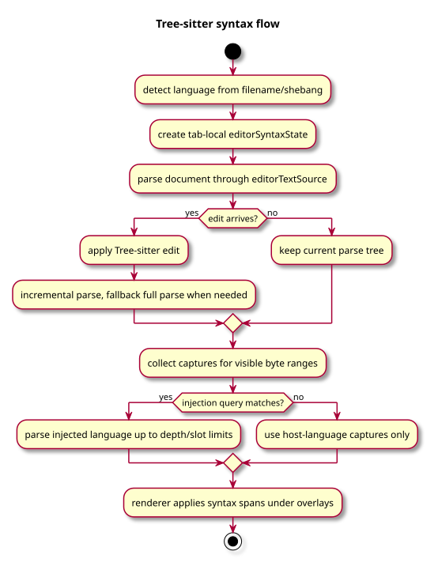
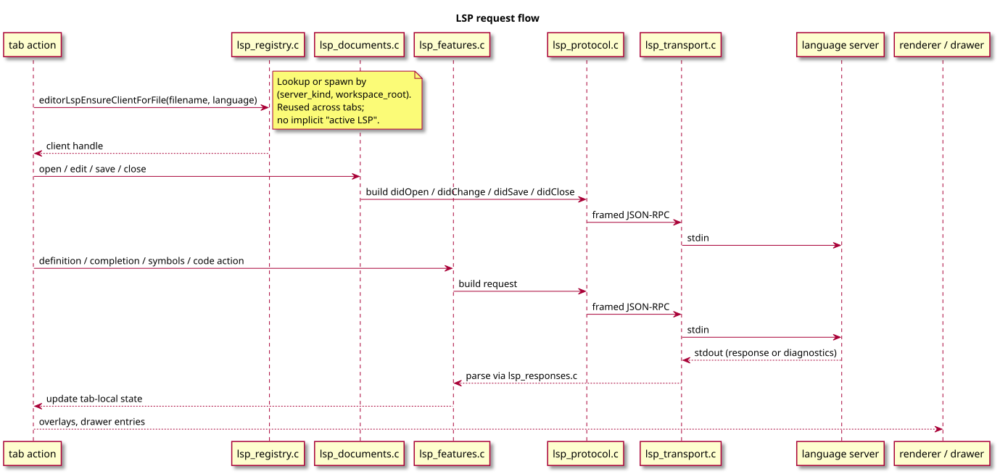
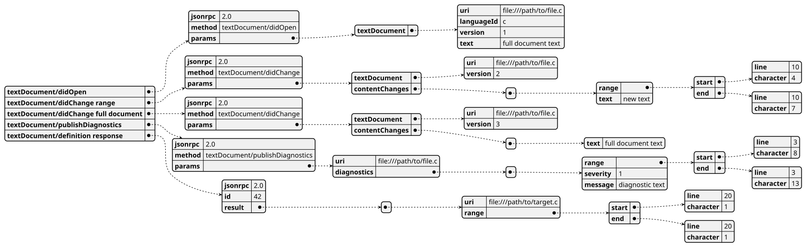
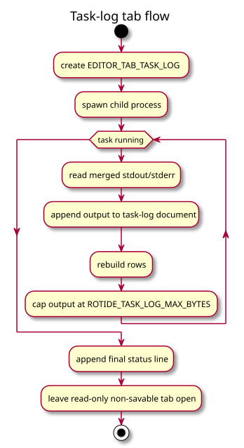

# Workflows

This page follows high-signal paths through RotIDE. The diagrams are intentionally
small: they show state ownership and sequencing without trying to duplicate the
source code.

## Startup and Main Loop

`main()` initializes terminal mode, config, tabs, recovery, syntax background
work, and workspace state. The loop pumps LSP notifications and background work,
draws the frame, reads input, and dispatches actions until quit.

## Keypress to Action

Terminal input is decoded in `src/support/terminal.c`. `src/input/dispatch.c`
handles prompt modes, mouse packets, drawer focus, and editor focus. Keymap
lookups resolve configured bindings to `enum editorAction`, then the dispatcher
calls the behavior implementation.

## Edit Application and Dirty State

Edits are constructed in `src/editing/edit.c` and selection helpers, then
applied through `editorApplyDocumentEdit()`. The edit descriptor carries the
byte range, inserted text, before/after cursor offsets, and before/after dirty
values. This keeps dirty-state behavior deterministic across insert, delete,
undo, redo, save, and recovery.

Document mutation happens before derived work:

- replace bytes in `editorDocument`
- rebuild `struct erow` cache
- sync cursor from byte offset
- update syntax state
- notify LSP clients
- record history entry
- refresh visible syntax spans on demand

## Undo and Redo

History entries store operations: removed bytes, inserted bytes, cursor offsets,
dirty values, and edit kind. Typing may coalesce into grouped entries. Any new
edit after undo clears redo history. Undo and redo replay document edits through
the same canonical mutation path instead of restoring full snapshots.

## Save and Recovery

Save reads the active document as text, writes a temporary file, fsyncs, renames,
fsyncs the parent directory, and clears dirty state only after success. Recovery
autosaves active workspace state and restores through the document-first loading
path, so restored rows remain derived from `editorDocument`.

## Search and Highlight

Search uses prompt callbacks in `src/input/dispatch.c` and scans the active
`editorTextSource`. The active match is stored as byte offset plus length.
Rendering maps the match back to rows and applies highlight overlays without
mutating text or dirty state.

## Syntax Highlighting

Language detection chooses a table entry from `src/language/languages.c`.
`editorSyntaxState` owns the Tree-sitter tree, injected trees, budgets, and
limit events for one tab. Visible rows request captures for byte ranges through
`src/language/syntax.c`; `src/render/screen.c` combines syntax spans with
selection, search, and diagnostic overlays.

## LSP

Opening or editing a supported file ensures the LSP document is tracked and
versioned. Changes are converted from editor byte/row state to protocol
positions. Requests such as definition, implementation, symbols, completion,
diagnostics, and ESLint code actions route through JSON-RPC helpers and write
results back to tab-local state.

Range `didChange` notifications are used when the edit can be represented in
the server's position encoding. RotIDE falls back to a full-document
`contentChanges` entry when range conversion would need pre-edit text.

Missing language servers can open install/help task-log tabs. Those tabs are
generated output views and do not become normal editable files.

## Task Logs

Task logs run a child process, merge stdout/stderr, append output to a generated
document, rebuild rows, and keep the tab open with a final status line. They are
read-only, non-savable, and capped by `ROTIDE_TASK_LOG_MAX_BYTES`.
